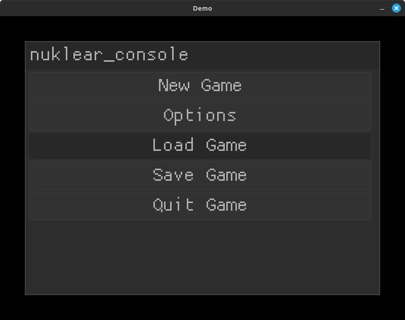

# nuklear_console

Console-like user interface for [Nuklear](https://github.com/Immediate-Mode-UI/Nuklear).



## Usage

``` c
#define NK_IMPLEMENTATION
#include "nukear.h"
#include "nuklear_console.h"

int main() {
    // Set up the console within the Nuklear context
    nk_console* console = nk_console_init(ctx);

    // Add some widgets
    nk_console_add_button(console, "New Game");
    nk_console* options = nk_console_add_button(console, "Options");
    {
        nk_console_add_button(options, "Some cool option!");
        nk_console_add_button(options, "Option #2");
        nk_console_add_button_onclick(options, "Back", nk_console_onclick_back);
    }
    nk_console_add_button(console, "Load Game");
    nk_console_add_button(console, "Save Game");

    // Render the console in a window
    nk_begin();
        nk_console_render(console);
    nk_end();

    // Clean it up
    nk_console_free(console);

    return 0;
}
```

## API

``` c
nk_console* nk_console_init(struct nk_context* context);
void nk_console_free(nk_console* console);
void nk_console_render(nk_console* console);
nk_console* nk_console_add_button_onclick(nk_console* parent, const char* text, void (*onclick)(nk_console*));
nk_console* nk_console_add_button(nk_console* parent, const char* text);
nk_console* nk_console_add_checkbox(nk_console* parent, const char* text, nk_bool* active);
nk_console* nk_console_add_combobox(nk_console* parent, const char* label, const char *items_separated_by_separator, int separator, int* selected);
nk_console* nk_console_add_progress(nk_console* parent, const char* text, nk_size* current, nk_size max);
nk_console* nk_console_add_label(nk_console* parent, const char* text);
void nk_console_onclick_back(nk_console* button);
nk_console* nk_console_get_top(nk_console* widget);
```

## License

[MIT](LICENSE)
