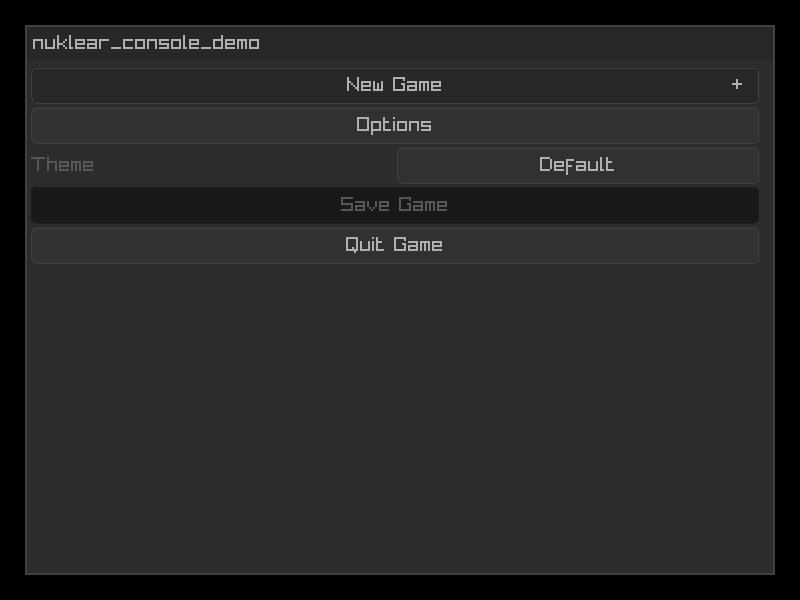

# nuklear_console

Console-like user interface for [Nuklear](https://github.com/Immediate-Mode-UI/Nuklear) with gamepad, keyboard or mouse support.



## Usage

``` c
#define NK_IMPLEMENTATION
#include "nukear.h"
#include "nuklear_console.h"

int main() {
    // Set up the console within the Nuklear context
    nk_console* console = nk_console_init(ctx);

    // Add some widgets
    nk_console_button(console, "New Game");
    nk_console* options = nk_console_button(console, "Options");
    {
        nk_console_button(options, "Some cool option!");
        nk_console_button(options, "Option #2");
        nk_console_button_onclick(options, "Back", nk_console_button_back);
    }
    nk_console_button(console, "Load Game");
    nk_console_button(console, "Save Game");

    // Render the console in a window
    nk_begin();
        nk_console_render(console);
    nk_end();

    // Clean it up
    nk_console_free(console);

    return 0;
}
```

## Widgets

- Button
- Checkbox
- Combobox
- Label
- Property
- Slider
- Tooltip

## API

``` c
// Console
NK_API nk_console* nk_console_init(struct nk_context* context);
NK_API void nk_console_free(nk_console* console);
NK_API void nk_console_render(nk_console* console);

// Widgets
NK_API nk_console* nk_console_button(nk_console* parent, const char* text);
NK_API nk_console* nk_console_checkbox(nk_console* parent, const char* text, nk_bool* active);
NK_API nk_console* nk_console_combobox(nk_console* parent, const char* label, const char *items_separated_by_separator, int separator, int* selected);
NK_API nk_console* nk_console_label(nk_console* parent, const char* text);
NK_API nk_console* nk_console_progress(nk_console* parent, const char* text, nk_size* current, nk_size max);
NK_API nk_console* nk_console_property_int(nk_console* parent, const char* label, int min, int *val, int max, int step, float inc_per_pixel);
NK_API nk_console* nk_console_property_float(nk_console* parent, const char* label, float min, float *val, float max, float step, float inc_per_pixel);
NK_API nk_console* nk_console_slider_int(nk_console* parent, const char* label, int min, int* val, int max, int step);
NK_API nk_console* nk_console_slider_float(nk_console* parent, const char* label, float min, float* val, float max, float step);

// Utilities
NK_API void nk_console_button_back(nk_console* button);
NK_API nk_console* nk_console_button_onclick(nk_console* parent, const char* text, void (*onclick)(struct nk_console*));
NK_API nk_console* nk_console_get_top(nk_console* widget);
NK_API int nk_console_get_widget_index(nk_console* widget);
NK_API void nk_console_tooltip(nk_console* console);
NK_API void nk_console_check_up_down(nk_console* widget, struct nk_rect bounds);
NK_API nk_bool nk_console_is_active_widget(nk_console* widget);
NK_API void nk_console_set_active_parent(nk_console* new_parent);
NK_API void nk_console_set_active_widget(nk_console* widget);
```

## Dependencies

- [Nuklear](https://github.com/Immediate-Mode-UI/Nuklear)
- [nuklear_gamepad](https://github.com/robloach/nuklear_gamepad)

## License

[MIT](LICENSE)
