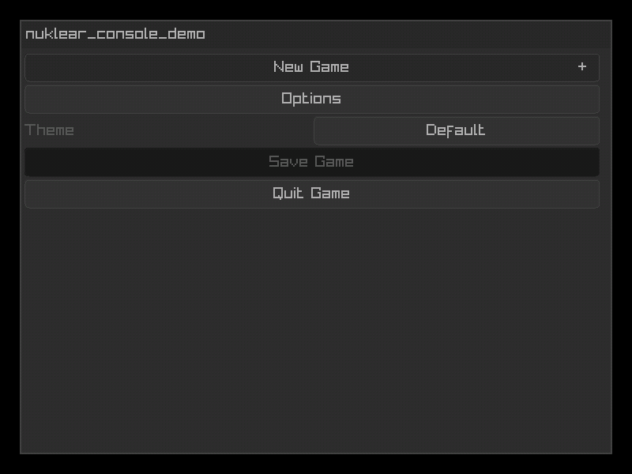

# nuklear_console

Console-like user interface for [Nuklear](https://github.com/Immediate-Mode-UI/Nuklear) with [gamepad](https://github.com/robloach/nuklear_gamepad), keyboard, and mouse support.



## Usage

``` c
#define NK_IMPLEMENTATION
#include "nukear.h"

// Gamepad support https://github.com/robloach/nuklear_gamepad
#define NK_GAMEPAD_IMPLEMENTATION
#include "nuklear_gamepad.h"

#define NK_CONSOLE_IMPLEMENTATION
#include "nuklear_console.h"

int main() {
    // Set up the console within the Nuklear context
    nk_console* console = nk_console_init(ctx);

    // Add some widgets
    nk_console_button(console, "New Game");
    nk_console* options = nk_console_button(console, "Options");
    {
        nk_console_button(options, "Some cool option!");
        nk_console_button(options, "Option #2");
        nk_console_button_onclick(options, "Back", &nk_console_button_back);
    }
    nk_console_button(console, "Load Game");
    nk_console_button(console, "Save Game");

    // Render the console in a window
    nk_console_render_window(console, "nuklear_console", nk_rect(0, 0, 400, 300), NK_WINDOW_TITLE);

    // Clean it up
    nk_console_free(console);

    return 0;
}
```

## Widgets

Buttons, Checkboxes, Color Select, Comboboxes, Files, Directories, Input (Gamepad, Keyboard, Mouse), Labels, Properties, Sliders, Knobs, Radio Options, Images, Rows, Spacing, TextEdit, Tree, Rule Horizontal, List View, Messages.

## API

See the [API Reference](https://github.com/RobLoach/nuklear_console/wiki) for how to use nuklear_console in your application.

``` c
// Console
nk_console* nk_console_init(struct nk_context* context);
void nk_console_free(nk_console* console);
void nk_console_free_children(nk_console* console);
void nk_console_render(nk_console* console);
struct nk_rect nk_console_render_window(nk_console* console, const char* title, struct nk_rect bounds, nk_uint flags);

// Widgets
nk_console* nk_console_button(nk_console* parent, const char* text);
nk_console* nk_console_button_onclick(nk_console* parent, const char* text, nk_console_event onclick);
nk_console* nk_console_checkbox(nk_console* parent, const char* text, nk_bool* active);
nk_console* nk_console_color(nk_console* parent, const char* label, struct nk_colorf* color, enum nk_color_format format);
nk_console* nk_console_combobox(nk_console* parent, const char* label, const char* items_separated_by_separator, int separator, int* selected);
nk_console* nk_console_dir(nk_console* parent, const char* label, char* dir_buffer, int dir_buffer_size);
nk_console* nk_console_dir_action(nk_console* parent, const char* label, char* dir_buffer, int dir_buffer_size);
nk_console* nk_console_file(nk_console* parent, const char* label, char* file_path_buffer, int file_path_buffer_size);
nk_console* nk_console_file_action(nk_console* parent, const char* label, char* file_path_buffer, int file_path_buffer_size);
nk_console* nk_console_image(nk_console* parent, struct nk_image image);
nk_console* nk_console_image_color(nk_console* parent, struct nk_image image, struct nk_color color);
nk_console* nk_console_input(nk_console* parent, const char* label, int gamepad_number, int* out_gamepad_number, enum nk_gamepad_button* out_gamepad_button, nk_rune* out_key, enum nk_buttons* out_mouse_button);
nk_console* nk_console_input_gamepad(nk_console* parent, const char* label, int gamepad_number, int* out_gamepad_number, enum nk_gamepad_button* out_gamepad_button);
nk_console* nk_console_input_key(nk_console* parent, const char* label, nk_rune* out_key);
nk_console* nk_console_input_mouse(nk_console* parent, const char* label, enum nk_buttons* out_mouse_button);
nk_console* nk_console_knob_int(nk_console* parent, const char* label, int min, int* val, int max, int step, float inc_per_pixel);
nk_console* nk_console_knob_float(nk_console* parent, const char* label, float min, float* val, float max, float step, float inc_per_pixel);
nk_console* nk_console_label(nk_console* parent, const char* text);
nk_console* nk_console_list_view(nk_console* parent, const char* id, int rows_visible, nk_uint item_count, nk_console_list_view_get_label get_label_callback);
nk_console* nk_console_progress(nk_console* parent, const char* text, nk_size* current, nk_size max);
nk_console* nk_console_property_int(nk_console* parent, const char* label, int min, int* val, int max, int step, float inc_per_pixel);
nk_console* nk_console_property_float(nk_console* parent, const char* label, float min, float* val, float max, float step, float inc_per_pixel);
nk_console* nk_console_radio(nk_console* parent, const char* label, int* selected);
nk_console* nk_console_row_begin(nk_console* parent);
void nk_console_row_end(nk_console* row);
nk_console* nk_console_rule_horizontal(nk_console* parent, struct nk_color color, nk_bool rounding);
void nk_console_show_message(nk_console* console, const char* text);
nk_console* nk_console_slider_int(nk_console* parent, const char* label, int min, int* val, int max, int step);
nk_console* nk_console_slider_float(nk_console* parent, const char* label, float min, float* val, float max, float step);
nk_console* nk_console_spacing(nk_console* parent, int cols);
nk_console* nk_console_textedit(nk_console* parent, const char* label, char* buffer, int buffer_size);
nk_console* nk_console_tree(nk_console* parent, const char* label, nk_bool expanded);

// Utilities
void nk_console_button_back(nk_console* button, void* user_data);
nk_console* nk_console_get_top(nk_console* widget);
int nk_console_get_widget_index(nk_console* widget);
int nk_console_height(nk_console* widget);
void nk_console_set_height(nk_console* widget, int height);
nk_bool nk_console_is_active_widget(nk_console* widget);
nk_bool nk_console_selectable(nk_console* widget);
void nk_console_set_active_parent(nk_console* new_parent);
void nk_console_set_active_widget(nk_console* widget);
nk_console* nk_console_active_parent(nk_console* console);
nk_console* nk_console_get_active_widget(nk_console* widget);
void nk_console_set_gamepads(nk_console* console, struct nk_gamepads* gamepads);
void nk_console_set_tooltip(nk_console* widget, const char* tooltip);
void nk_console_set_user_data(nk_console* console, void* user_data);
void* nk_console_user_data(nk_console* console);
const char* nk_console_get_label(nk_console* widget);
void nk_console_set_label(nk_console* widget, const char* label, int label_length);
nk_bool nk_console_navigate_to_path(nk_console* console, const char* path);
nk_console* nk_console_find_by_path(nk_console* console, const char* path);
nk_bool nk_console_trigger_event(nk_console* widget, nk_console_event_type type);
void nk_console_check_tooltip(nk_console* console);
void nk_console_check_up_down(nk_console* widget);
```

## Dependencies

- C99+
- [Nuklear](https://github.com/Immediate-Mode-UI/Nuklear)
- [nuklear_gamepad](https://github.com/robloach/nuklear_gamepad)
- [c-vector](https://github.com/eteran/c-vector/)

## Configuration

- `NK_BUTTON_TRIGGER_ON_RELEASE`: Required in order to ensure Nuklear events are triggered in the correct order
- `NK_CONSOLE_KEY_BACK`: The `nk_keys` enumeration that will be used to go back in the menu hierarchy. Defaults to ESC.
- `NK_CONSOLE_DRAG_THRESHOLD`: The amount of threshold mouse movement needed to consider it a scroll
- `NK_CONSOLE_AXIS_DEADZONE`: The amount of movement the gamepad axis needs prior to moving the cursor
- `NK_CONSOLE_AXIS_REPEAT_INTERVAL`: When using the gamepad axis to move, how frequently the cursor will move
- `NK_CONSOLE_MALLOC`: Memory allocation function used internally
- `NK_CONSOLE_FREE`: Memory free function used internally
- `NK_CONSOLE_IGNORE_BUTTON_TRIGGER_ON_RELEASE`: Define to suppress the `NK_BUTTON_TRIGGER_ON_RELEASE` warning
- `NK_CONSOLE_FILE_PATH_MAX`: Maximum file path length used by the file widget
- `NK_CONSOLE_FILE_ADD_FILES`: The function callback used to enumerate files; see `nk_console_file_add_files_tinydir()`
- `NK_CONSOLE_ENABLE_TINYDIR`: Define to use tinydir for file enumeration; corresponds to CMake option `NUKLEAR_CONSOLE_ENABLE_TINYDIR=ON` (default: OFF)
- `NK_CONSOLE_FILE_ADD_FILES_TINYDIR_H`: Path to the tinydir header when using the tinydir file backend
- `NK_CONSOLE_FILE_ADD_FILES_TINYDIR_SKIP`: Define to skip the tinydir header include (provide your own include before)
- `NK_CONSOLE_INPUT_TIMER`: Seconds to wait for input before timing out in the input widget
- `NK_CONSOLE_TEXTEDIT_MASKED_LENGTH`: Number of `*` characters shown when the text-edit widget is in masked/password mode
- `NK_CONSOLE_TEXTEDIT_PREVIEW_LENGTH`: Maximum preview character count shown in a collapsed text-edit widget
- `NK_CONSOLE_MESSAGE_DURATION`: Seconds a message widget is displayed before auto-dismissal
- `NK_CONSOLE_MESSAGE_SCROLL_SPEED`: Pixels per second at which a long message scrolls horizontally
- `NK_CONSOLE_MESSAGE_SCROLL_PAUSE`: Seconds to pause at the start and end of a scrolling message
- `NK_CONSOLE_FILE_SDL_NATIVE_DIALOG`: In SDL3, will enable file widgets to use native file dialogs
- `NK_CONSOLE_GAMEPAD`: Defined automatically when [nuklear_gamepad](https://github.com/robloach/nuklear_gamepad) is included before nuklear_console; enables gamepad input support
- `NK_CONSOLE_NO_GAMEPAD`: Define to force-disable gamepad support even when nuklear_gamepad is present; corresponds to CMake option `NUKLEAR_CONSOLE_GAMEPAD=OFF`

## Development

Use [clang-format](https://clang.llvm.org/docs/ClangFormat.html) to apply coding standards.
``` sh
clang-format -i *.h
```

To build the web demo...
```bash
cd demo/raylib
mkdir build
cd build
emcmake cmake .. -DPLATFORM=Web -DCMAKE_BUILD_TYPE=Release -DCMAKE_EXECUTABLE_SUFFIX=".html"
emmake make
```

## License

[MIT](LICENSE)
